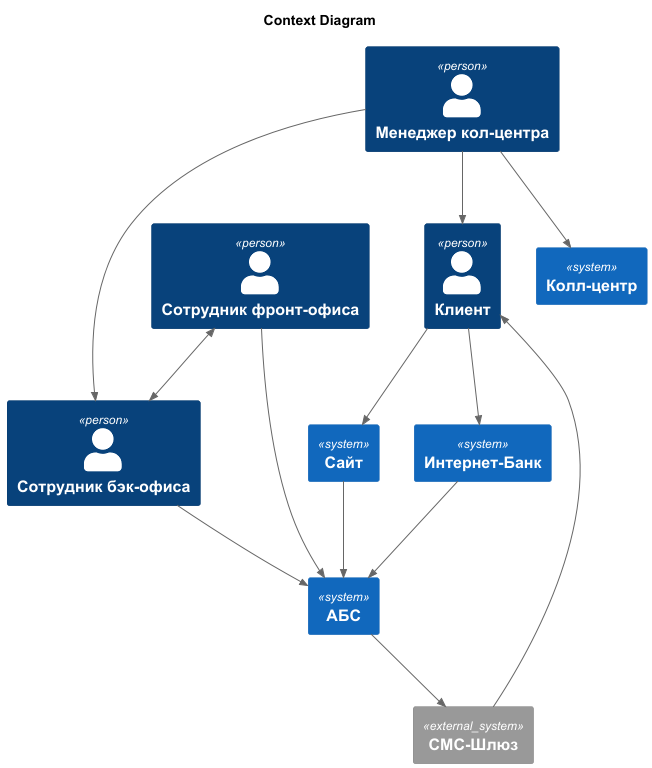
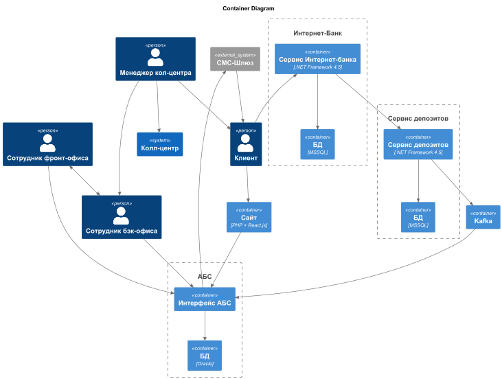

### **Название задачи:** Открытие депозитов онлайн 
### **Автор:** Смирнов Александр
### **Дата:** 09.07.2025
### **Функциональные требования**

| **№** | **Действующие лица или системы**                                                                       | **Use Case**                                | **Описание**                                                                                                                                                                                                                                                                                                                                                                                                                                                                                                                                                                 |
|:-----:|:-------------------------------------------------------------------------------------------------------|:--------------------------------------------|:-----------------------------------------------------------------------------------------------------------------------------------------------------------------------------------------------------------------------------------------------------------------------------------------------------------------------------------------------------------------------------------------------------------------------------------------------------------------------------------------------------------------------------------------------------------------------------|
|  UC1  | Интернет-банк, клиент, сотрудник бэк-офиса, СМС-шлюз                                                   | Открытие депозита через интернет-банк       | 1. Клиент знакомится с предложениями банка в интернет-банке  2. Клиент указывает счёт и сумму депозита   3.Клиент подтверждает операцию через СМС-код.   4. Сотрудник бэк-офиса одобряет заявку на депозит   5. Клиент получает СМС об успешном открытии депозита и его ставке                                                                                                                                                                                                                                                                               |
|  UC2  | Новый клиент, менеджер кол-центра, система кол-центра, сотрудник бэк-офиса, АБС, сотрудник фронт-офиса | Заявка на открытие депозита новым клиентом  | 1. Новый клиент знакомится с предложениями банка на сайте   2. Клиент оставляет на сайте заявку, указав свои ФИО и номер телефона   3. Менеджер кол-центра знакомится с заявкой и согласовывает особое предложение для нового клиента с сотрудником бэк-офиса   4. Менеджер связывается с клиентом и знакомим его с индивидуальным предложением.  5. Клиент приходит в офис для регистрации в банковской системе   6. Сотрудник фронт-офиса регистрирует нового клиента в системе.   7. Клиент получает СМС-оповещение об успешном открытии депозита |
### **Нефункциональные требования**
Опишите здесь нефункциональные требования и архитектурно значимые требования.

| **№** | **Требование**                                                                                           |
|:-----:|:---------------------------------------------------------------------------------------------------------|
|   1   | Интерфейс должен быть максимально удобным для клиента                                                    |
|   2   | Отклик по всем операциям должен быть максимально быстрым и занимать миллисекунды                         |
|   3   | Все сервисы банка должны работать 24/7 и быть доступны в 99,9% случаев                                   |
|   4   | Обеспечение шифрования данных при передаче                                                               |
|   5   | При доработках во всех системах нужно как можно больше использовать технологии, которые уже есть в банке |
|   6   | Функционал СМС-оповещений необходимо реализовать своими силами без привлечения подрядчика                |
|   7   | Возможность горизонтального масштабирования системы                                                      |
### **Решение**
### Диаграмма контекста

    
### Диаграмма контейнеров

- Сервис депозитов выделен в отдельный сервис для обеспечения возможности горизонтального масштабирования с целью уменьшения времени отклика.
- В сервисе депозитов используется БД MSSQL т.к она уже имеется в стеке.
- Использован фреймворк ASP.NET, так как у команды имеется экспертиза в нем.
- Использования Kafka для исключения прямого обращения к API АБС.

### **Альтернативы**

- Реализация сервиса депозитов внутри АБС была отвергнута из-за невозможности горизонтального масштабирования.
- Прямое использование API АБС не подходит, т.к. есть опасность перегрузки системы.

**Недостатки, ограничения, риски**

 - Текущая версия Интернет-Банка не совместима с Kafka. 
 - Монолит АБС всё ещё возможно масштабировать только вертикально.
 