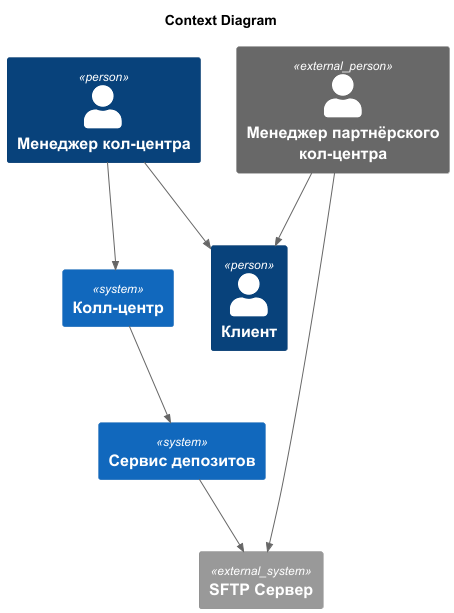
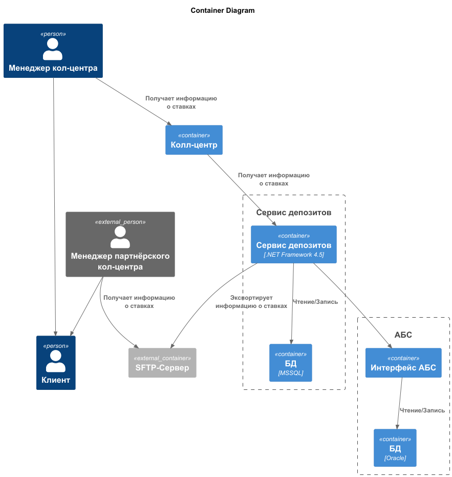
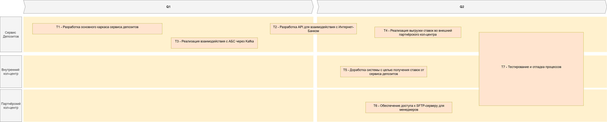

### **Название задачи:** Передача ставок в кол-центры 
### **Автор:** Смирнов Александр
### **Дата:** 09.07.2025
### **Функциональные требования**

| **№** | **Действующие лица или системы**                                | **Use Case**                   | **Описание**                                                                                                                                                                                                                        |
|:-----:|:----------------------------------------------------------------|:-------------------------------|:------------------------------------------------------------------------------------------------------------------------------------------------------------------------------------------------------------------------------------|
|  UC1  | Менеджер кол-центра, Система кол-центра                         | Получение информации о ставках | Менеджер получает актуальные ставки через интерефейс системы кол-центра                                                                                                                                                             |
|  UC2  | Менеджер партнёрского кол-центра, SFTP-Сервер, Сервер Депозитов | Передача информации о ставках  | 1. При изменении ставок сервис депозитов генерирует файл с информацией о ставках и кладёт его на SFTP-сервер   2. Менеджер партнёрского кол-центра открывает файл на SFTP-сервере для получения актуальной информации о ставках |
### **Нефункциональные требования**

| **№** | **Требование**                                            |
|:-----:|:----------------------------------------------------------|
|   1   | Доступность сервиса депозитов 99.9%, работа 24/7          |
|   2   | АPI с информацией о ставках для внутреннего кол-центра    |
|   3   | Отгрузка информации о ставках для партнёрского кол-центра |

### **Решение**

### Диаграмма контекста

    
### Диаграмма контейнеров

- Для внутреннего кол-центра нас устраивает API от уже масштабированного и вынесенного микросервиса депозитов.
- Т.к. партнёрский центр во внешней информационной системе относительно банка и он может работать только с файлами, то в данном случае нас устроит использование внешнего SFTP-сервера.
- Изменения в SFTP-сервер заливаются по триггеру, а не по таймеру, что обеспечит минимальные задержки предоставления данных со стороны банка.

### **Альтернативы**
- Предоставление API для партнёрского кол-центра невозможно из-за его ограничений.

**Недостатки, ограничения, риски**

- Менеджеру партнёрского кол-центра необходимо постоянно самостоятельно проверять наличие свежей версии файла с информацией о ставках на SFTP-сервере.

## Список задач 

| **** | **Система**                                                   | Задача                                                          |
|:----:|:--------------------------------------------------------------|-----------------------------------------------------------------|
|  T1  | Сервис депозитов                                              | Разработка основного каркаса сервиса депозитов                  |
|  T2  | Сервис депозитов                                              | Разработка API для взаимодействия с Интернет-Банком             |
|  T3  | Сервис депозитов                                              | Реализация взаимодействия с АБС через Kafka                     |
|  T4  | Сервис депозитов                                              | Реализация выгрузки ставок во внешний партнёрского кол-центра   |
|  T5  | Внутренний кол-центр                                          | Доработка системы с целью получения ставок от сервиса депозитов |
|  T6  | Партнёрский кол-центр                                         | Обеспечение доступа к SFTP-серверу для менеджеров               |
|  T7  | Сервис депозитов, внутренний кол-центр, партнёрский кол-центр | Тестирование и отладка процессов                                |

## Roadmap

